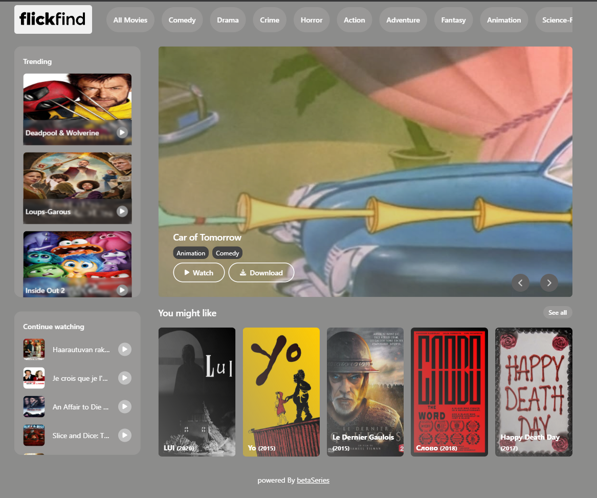
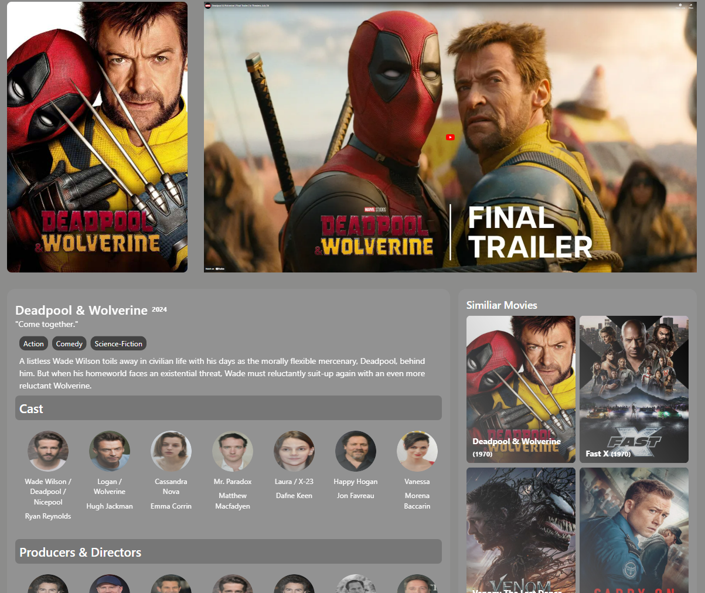
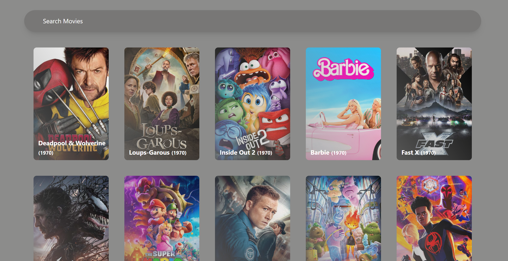

# 🎥 Movie Search Website

Discover movies and watch trailers with ease on this sleek, user-friendly platform. Built with **React** and **Tailwind CSS**, the website integrates with movie APIs for a seamless search experience.

## 🌟 Features
- 🔍 Search movies by title, genre, or release year.
- 📽️ Watch official trailers directly on the platform.
- 🎨 Fully responsive design for all devices.

## 🛠️ Tech Stack
- **Frontend**: React, Tailwind CSS
- **Backend/API**: Betaseries API (or any other used) 

## 🚀 Preview








## 🚀 Get Started
1. Clone the repository:
   ```bash
   git clone https://github.com/Prasannajaga/movie-app.git
